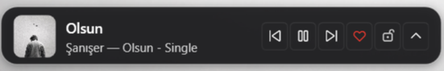
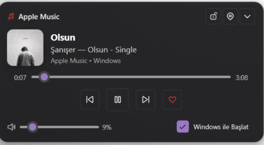

# PommeBar

A modern, lightweight Windows 11 taskbar companion and mini-player for **Apple Music** and **Spotify**.

Built with .NET 8 and WPF, PommeBar brings instant playback controls, album art, interactive timeline scrubbing, master volume control, and native favorite/like integration right to your taskbar.

<p align="center">
  
  <br/><br/>
  
</p>

---

## Features

- **Apple Music & Spotify Dual Support**: Automatically detects active playback and switches branding, metadata, album art, and accent colors in real-time (Apple Red `#FF3B30` or Spotify Green `#1DB954`).
- **Dual Display Modes**:
  - 🏝️ **Floating Island Mode**: Floats gracefully 10px above the taskbar with smooth 16px rounded acrylic corners.
  - 📌 **Embedded Taskbar Mode**: Sits directly on the taskbar surface with zero gap, designed to look like a native Windows 11 taskbar widget.
- **3-Stage Smart Locking**:
  - 🔓 **Free**: Freely draggable anywhere across the screen.
  - 🔒 **Taskbar Locked**: Fixed in place on the taskbar to prevent accidental dragging.
  - 📌 **Super Locked (Game & Overlay Mode)**: Enforces `HWND_TOPMOST` z-order priority so full-screen borderless games and applications never cover the widget.
- **Native Favorite / Like Integration**: Dedicated heart button toggles favorites directly inside Apple Music (via UI Automation) or Spotify (via automation & shortcut).
- **Expandable Flyout**: Expands upwards with smooth 60fps slide & fade animations to reveal large album art, interactive timeline scrubber, and volume slider.
- **System Tray Integration**: Native tray icon beside the clock. Left-click to show/hide the widget, right-click for the full context menu.
- **System Media Transport Controls (SMTC)**: Synchronized with Windows media sessions for real-time track metadata and timeline progress.
- **Smooth Volume Control**: Mouse wheel over the widget or use the flyout volume slider powered by Windows CoreAudio.
- **Windows Startup**: Optional silent startup on system boot via Windows Registry.

---

## Installation & Getting Started

### 1. Download Pre-compiled Binary
1. Go to the [Releases](https://github.com/blosny/PommeBar/releases) page.
2. Download the latest `PommeBar-win-x64.zip` release archive.
3. Extract the folder to a permanent location (e.g., `C:\Program Files\PommeBar` or `C:\Tools\PommeBar`).
4. Run `PommeBar.exe`.

### 2. First Run & Configuration
- On initial launch, select your preferred appearance and position:
  - **Mode**: Floating Island or Embedded Taskbar.
  - **Position**: Left (Start menu), Center (Taskbar icons), or Right (System tray).
- Start playing music in Apple Music or Spotify, and PommeBar will immediately sync.

---

## Controls and Shortcuts

| Action | Control |
| :--- | :--- |
| **Play / Pause** | Play/Pause icon button |
| **Next / Previous Track** | Next / Previous icon buttons |
| **Favorite Track (Apple Music / Spotify)** | Heart icon button |
| **Expand / Collapse Flyout** | Chevron Up / Down button |
| **Adjust Volume** | Mouse scroll wheel anywhere on the widget, or slider in expanded view |
| **Bring Active Music App to Front** | Click the song title or album artwork |
| **Cycle Lock Mode** | Lock button on widget (Cycles: Free ➔ Locked ➔ Super Locked) |
| **Switch Display Mode** | Right-click ➔ Görünüm Modu (Ada Modu / Görev Çubuğuna Entegre) |
| **Toggle Show / Hide** | Left-click system tray icon near the clock |
| **Context Menu** | Right-click the widget or tray icon for settings, dock mode, startup, and exit |

---

## Project Structure

```
pomme-bar/
├── App.xaml / App.xaml.cs          # WPF application lifecycle and Fluent theme resources
├── MainWindow.xaml / .cs           # Mini-player UI, expanded flyout, events, and drag logic
├── PositionDialog.xaml / .cs       # Initial setup & repositioning dialog
├── MediaController.cs              # Windows SMTC session manager & media event listener
├── AppleMusicAutomation.cs         # UI Automation engine to toggle Favorites in Apple Music
├── VolumeController.cs             # Windows CoreAudio (IAudioEndpointVolume) COM wrapper
├── StartupManager.cs               # Windows Registry Run key manager for automatic startup
├── PommeBar.csproj                 # .NET 8 project configuration & dependencies
└── docs/
    └── screenshot.png              # Application preview image
```

---

## Building from Source

### Prerequisites
- Windows 10 (Build 19041+) or Windows 11
- [.NET 8.0 SDK](https://dotnet.microsoft.com/download/dotnet/8.0)

### Clone & Build
```powershell
# Clone repository
git clone https://github.com/blosny/PommeBar.git
cd PommeBar

# Restore dependencies
dotnet restore

# Build debug build
dotnet build

# Publish standalone release
dotnet publish -c Release -r win-x64 --self-contained true -o ./publish
```

The compiled executable and dependencies will be generated in `./publish/PommeBar.exe`.

---

## License

This project is licensed under the MIT License - see the [LICENSE](LICENSE) file for details.
