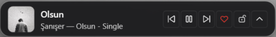

# PommeBar

A modern, lightweight Windows 11 taskbar mini-player and companion widget for **Apple Music**.

Built with .NET 8 and WPF, PommeBar floats seamlessly above the Windows taskbar, providing instant playback controls, album art, interactive timeline, volume adjustment, and native Apple Music favorite integration without interrupting your workflow.

<p align="center">
  
</p>

---

## Features

- **Seamless Taskbar Integration**: Docks comfortably above the Windows 11 taskbar. Choose Left (Start menu), Center (Taskbar icons), or Right (System tray / clock), or position it anywhere on your desktop.
- **Position Locking**: Lock widget position to prevent accidental dragging during playback or clicks.
- **Expandable Flyout**: Expand upwards to reveal a larger artwork display, full timeline scrubber with timestamps, volume slider, and quick configuration switches.
- **Apple Music Favorite/Like Integration**: Dedicated heart button interacts directly with the Apple Music for Windows desktop application to toggle favorites via UI Automation.
- **System Media Transport Controls (SMTC)**: Real-time track metadata (Song Title, Artist, Album Art, Duration) synchronized directly with Windows media sessions.
- **Smooth Volume Control**: Adjust master volume directly using your mouse wheel over the widget or via the expanded flyout slider powered by Windows CoreAudio.
- **Windows Startup**: Run automatically on system boot via a built-in startup manager.
- **Fluent 2 Dark Theme**: Clean, borderless design with rounded corners, subtle acrylic backgrounds, and elevation shadows matching the native Windows 11 aesthetics.

---

## Installation & Getting Started

### 1. Download Pre-compiled Binary
1. Go to the [Releases](https://github.com/blosny/PommeBar/releases) page.
2. Download the latest `PommeBar-win-x64.zip` release archive.
3. Extract the folder to a permanent location (e.g., `C:\Program Files\PommeBar` or `C:\Tools\PommeBar`).
4. Run `PommeBar.exe`.

### 2. First Run
- On initial launch, PommeBar prompts you to select your preferred taskbar dock position:
  - **Left**: Placed near the Start button.
  - **Center**: Placed next to centered taskbar app icons.
  - **Right**: Placed above the system tray and clock.
- Make sure Apple Music for Windows is running and playing audio. PommeBar will immediately sync metadata and album artwork.

---

## Controls and Shortcuts

| Action | Control |
| :--- | :--- |
| **Play / Pause** | Play/Pause icon button |
| **Next / Previous Track** | Next / Previous icon buttons |
| **Favorite Track (Apple Music)** | Heart icon button |
| **Expand / Collapse Flyout** | Chevron Up / Down button |
| **Adjust Volume** | Mouse scroll wheel anywhere on the widget, or slider in expanded view |
| **Bring Apple Music to Front** | Click the song title or album artwork |
| **Move Widget** | Left-click and drag (when position lock is disabled) |
| **Lock / Unlock Position** | Lock icon in flyout or right-click context menu |
| **Change Dock Position** | Location icon in flyout or right-click context menu |
| **Context Menu** | Right-click the widget for settings, startup toggle, and exit |

---

## Project Structure

```
pomme-bar/
├── App.xaml / App.xaml.cs          # WPF application lifecycle and Fluent theme resources
├── MainWindow.xaml / .cs           # Mini-player UI, expanded flyout, events, and drag logic
├── PositionDialog.xaml / .cs       # Initial setup & repositioning dialog
├── MediaController.cs              # Windows SMTC session manager & media event listener
├── AppleMusicAutomation.cs         # UI Automation engine to toggle Favorites in Apple Music
├── VolumeController.cs             # Windows CoreAudio (IAudioEndpointVolume) COM wrapper
├── StartupManager.cs               # Windows Registry Run key manager for automatic startup
├── PommeBar.csproj                 # .NET 8 project configuration & dependencies
└── docs/
    └── screenshot.png              # Application preview image
```

---

## Building from Source

### Prerequisites
- Windows 10 (Build 19041+) or Windows 11
- [.NET 8.0 SDK](https://dotnet.microsoft.com/download/dotnet/8.0)

### Clone & Build
```powershell
# Clone repository
git clone https://github.com/blosny/PommeBar.git
cd PommeBar

# Restore dependencies
dotnet restore

# Build debug build
dotnet build

# Publish standalone release
dotnet publish -c Release -r win-x64 --self-contained true -o ./publish
```

The compiled executable and dependencies will be generated in `./publish/PommeBar.exe`.

---

## License

This project is licensed under the MIT License - see the [LICENSE](LICENSE) file for details.
