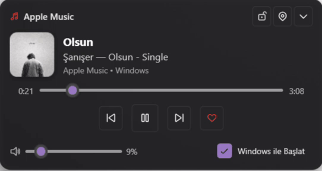

# PommeBar

A modern, lightweight Windows 11 taskbar companion and mini-player for **Apple Music** and **Spotify**.

Built with .NET 8 and WPF, PommeBar brings instant playback controls, album art, interactive timeline scrubbing, master volume control, and native favorite/like integration right to your taskbar.

<p align="center">
  
</p>

---

## Interface Overview

| Compact Taskbar Mode | Expanded Flyout View |
| :---: | :---: |
|  |  |
| Discreet taskbar pill with live metadata and controls | Upward expanding flyout with full timeline and volume slider |

---

## Key Features

- **Apple Music and Spotify Dual Support**: Automatically detects the active media session and dynamically switches branding, metadata, album artwork, and accent colors in real-time (Apple Red `#FF3B30` or Spotify Green `#1DB954`).
- **Dual Display Modes**:
  - **Floating Island Mode**: Floats 10 pixels above the Windows taskbar with smooth 16px rounded acrylic corners.
  - **Embedded Taskbar Mode**: Rests directly against the taskbar edge with zero gap, blending seamlessly as a native Windows 11 taskbar widget.
- **3-Stage Smart Locking**:
  - **Free**: Freely movable anywhere across your monitors via mouse drag.
  - **Taskbar Locked**: Fixed in place on the taskbar to prevent accidental repositioning.
  - **Super Locked (Game and Overlay Mode)**: Enforces `HWND_TOPMOST` z-order priority so full-screen borderless games and media applications never obscure the widget.
- **Native Favorite and Like Automation**: Dedicated heart button toggles favorites directly inside Apple Music (via UI Automation) or Spotify (via desktop client automation).
- **Smooth Flyout Animations**: Expands upward with 60fps easing animations to reveal full album art, track duration scrubbing, and volume control.
- **System Tray Integration**: Native tray icon beside the Windows system clock. Left-click toggles widget visibility; right-click opens the context menu.
- **System Media Transport Controls (SMTC)**: Directly binds to Windows media sessions for low-latency playback events, track metadata, and timeline synchronization.
- **Master Volume Control**: Scroll with your mouse wheel anywhere over the widget or use the slider in the expanded flyout view.
- **Automatic Startup**: Optional silent startup on system boot configured through the Windows Registry.

---

## Installation

### Option 1: Download Pre-compiled Binary (Recommended)

1. Navigate to the [Releases](https://github.com/blosny/PommeBar/releases) page.
2. Download the latest `PommeBar-win-x64.zip` release archive.
3. Extract the folder to a permanent location (e.g., `C:\Program Files\PommeBar` or `C:\Tools\PommeBar`).
4. Launch `PommeBar.exe`.

### Option 2: Build from Source

#### Prerequisites
- Windows 10 (Build 19041 or higher) or Windows 11
- [.NET 8.0 SDK](https://dotnet.microsoft.com/download/dotnet/8.0)

---

## Dependency Management and Installation

PommeBar is built with C# and .NET 8. In the .NET ecosystem, dependencies are managed via **NuGet** rather than Python's `pip` or Node's `npm`.

### What is `dotnet restore`?
Running `dotnet restore` is the .NET equivalent of `pip install -r requirements.txt` or `npm install`:
- It inspects `PommeBar.csproj` for required packages.
- It downloads and caches all required external libraries and framework references (such as `Wpf.Ui` for modern Windows 11 Fluent styling and Windows SDK projection packages).
- It verifies package integrity and prepares the workspace for compilation.

### Restoring Dependencies

You can restore dependencies using any of the following methods:

1. **Via Command Line**:
   ```powershell
   dotnet restore
   ```

2. **Via One-Click Batch Script**:
   Double-click `install_dependencies.bat` in the repository root.

3. **Requirements File**:
   For developers familiar with Python environments, a `requirements.txt` file is included in the project root documenting all package versions, SDK requirements, and Windows API references.

---

## Building and Publishing

Once dependencies are restored, you can build or publish PommeBar:

```powershell
# Clone the repository
git clone https://github.com/blosny/PommeBar.git
cd PommeBar

# Restore all NuGet package dependencies
dotnet restore

# Build debug binary
dotnet build

# Compile a self-contained, standalone single-folder release
dotnet publish -c Release -r win-x64 --self-contained true -o ./publish
```

The compiled standalone executable and all runtime assets will be generated in `./publish/PommeBar.exe`.

---

## Controls and Shortcuts

| Action | Interaction / Control |
| :--- | :--- |
| **Play / Pause** | Play/Pause icon button |
| **Next / Previous Track** | Next / Previous track buttons |
| **Favorite / Like Track** | Heart icon button (supports Apple Music and Spotify) |
| **Expand / Collapse Flyout** | Chevron Up / Down button |
| **Adjust Volume** | Mouse scroll wheel over the widget, or slider in expanded view |
| **Bring Music App to Front** | Click album artwork in compact mode or expanded view |
| **Cycle Lock Mode** | Lock button on widget (Cycles: Free -> Locked -> Super Locked) |
| **Switch Dock Mode** | Right-click -> Display Mode (Floating Island / Embedded Taskbar) |
| **Toggle Visibility** | Left-click system tray icon near the clock |
| **Context Menu** | Right-click the widget or tray icon for display modes, settings, and exit |

---

## Project Structure

```
pomme-bar/
├── .github/
│   └── workflows/
│       └── release.yml             # Automated GitHub Actions CI/CD release pipeline
├── docs/
│   ├── demo.gif                    # Animated demonstration for documentation
│   ├── preview_compact.png         # Compact mode screenshot
│   └── preview_expanded.png        # Expanded flyout screenshot
├── App.xaml / App.xaml.cs          # WPF application lifecycle and theme resources
├── MainWindow.xaml / .cs           # Primary widget UI, flyout animations, drag and lock logic
├── PositionDialog.xaml / .cs       # Initial setup and dock mode selection dialog
├── MediaController.cs              # Windows SMTC session manager and real-time event listener
├── AppleMusicAutomation.cs         # UI Automation engine to toggle favorites in Apple Music
├── SpotifyAutomation.cs            # Desktop client integration and automation for Spotify
├── VolumeController.cs             # Windows CoreAudio COM wrapper (IAudioEndpointVolume)
├── StartupManager.cs               # Windows Registry Run key manager for auto-start
├── TrayIconManager.cs              # Native Win32 system tray notification icon handler
├── PommeBar.csproj                 # .NET 8 project definition and NuGet dependencies
├── requirements.txt                # Requirements and dependency specification file
└── install_dependencies.bat        # One-click dependency restoration script for Windows
```

---

## Technical Specifications

- **Target Framework**: .NET 8.0 Windows Desktop (`net8.0-windows10.0.19041.0`)
- **UI Architecture**: Windows Presentation Foundation (WPF) with `Wpf.Ui` Fluent design controls
- **Media Integration**: Windows Runtime `GlobalSystemMediaTransportControlsSessionManager`
- **Audio Interface**: CoreAudio Endpoint Volume (`MMDeviceEnumerator`, `IAudioEndpointVolume`)
- **Window Positioning**: Direct Win32 Interop (`SetWindowPos`, `FindWindow`, `Shell_TrayWnd`)

---

## License

This project is licensed under the MIT License. See the [LICENSE](LICENSE) file for details.
